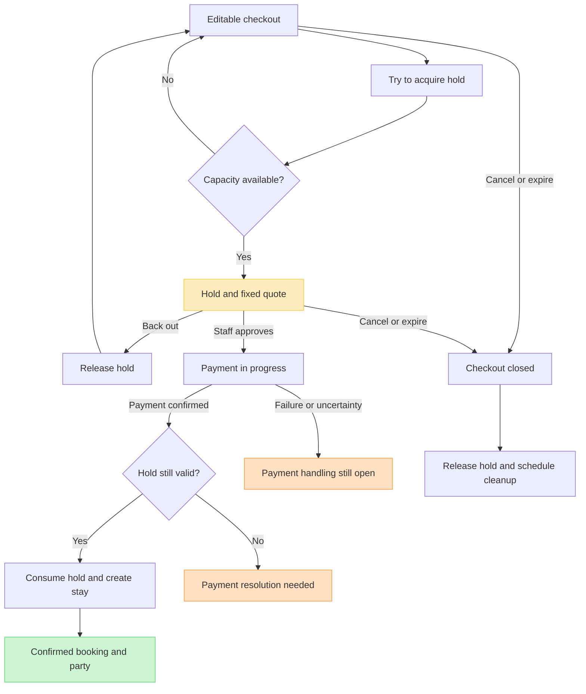
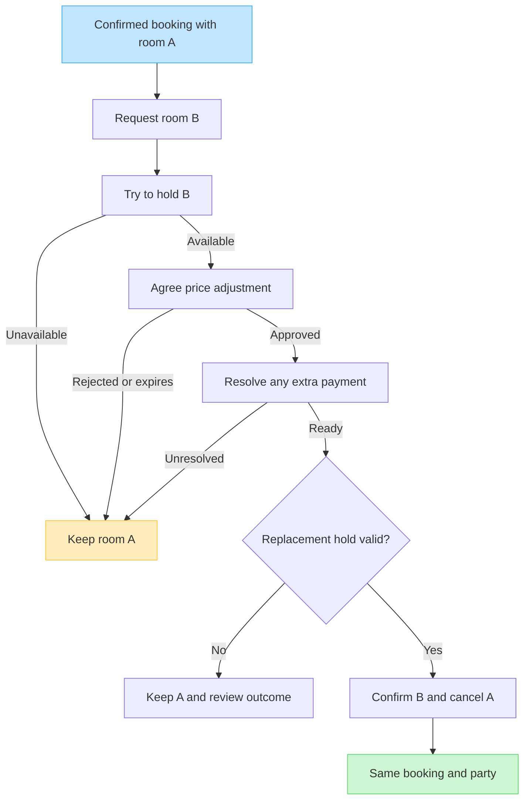

# Checkout, booking and room changes

Review of sections A and B of the [design checklist](design-review.md).
This is a behaviour sketch, not an implementation or final set of database
states. The checkout name replaces “draft booking” in this discussion.

## Decisions from this pass

- Checkout holds the proposed payer/contact information, guest information,
  dietary requirements and party accommodations before a booking exists.
- Shopping and editing do not reserve capacity. Competing checkouts may select
  the same room; only one can acquire a conflicting hold when proceeding to pay.
- Acquiring a hold must recheck availability and reserve the requested capacity
  together. The loser returns to selection without entering payment for that
  unavailable allocation. Multiple rooms and activities still need a rule for
  whether the hold covers the whole basket or individual items.
- A held checkout is frozen. To edit, back out of the hold first; the edited
  checkout must compete for capacity again. Editing is not an implicit extension
  or modification of the current hold.
- Preserve the agreed price rather than looking up current prices at payment
  time. Keep item amounts, applicable adjustments, currency and the agreed total.
  The subsequent review selects Confirm/proceed to checkout as the quote-lock
  action, before payment. The flow maps that action to acquiring the hold.
- A booking is created only after payment is confirmed. Staff approval is also
  requested; the working interpretation is that both are required. Approval
  does not stand in for payment. The ordering below is a proposal for review.
- Confirmation cannot consume an expired hold. Payment success and successful
  reservation creation are distinct outcomes that must both be accounted for.
- On success, create the booking, party, guests and accepted reservations, and
  consume the hold in one local transaction. External payment is not part of
  that database transaction.
- Abandoned or expired checkout personal data should be deleted. Exact expiry,
  sweep delay, copies elsewhere, and treatment of unsettled payments remain open.
- Technical errors are not booking states. They belong to operations/jobs; the
  existing booking remains valid. Remove `error` in the next DDL revision.
- A room change is within the existing booking. It does not replace the booking,
  party, activity reservations or party details.
- Replacing an entire booking is different: the old booking is cancelled and
  its party's entitlements no longer apply. Retained history is not erased or
  automatically transferred to the new booking.
- Additional travellers can make a separate booking even if they travel with
  an existing party. Early departures and corrections still need a small rule.

## 1. Checkout to a confirmed booking

**Proposed ordering:** staff approves the held, fixed quote before payment.
The subsequent review fixes the quote on Confirm/proceed to checkout, before
payment. This flow maps that action to taking the hold; the agreed quote is
retained even if catalogue prices later change.

Read “hold still valid” as a condition checked by the same local transaction
that consumes it and creates the stay, not an earlier unlocked check. Duplicate
payment notifications must not create duplicate bookings. A changed or closed
checkout cannot accidentally accept a result for an older payment attempt.

“Payment resolution needed” is not an errored booking: no booking was created.
A late payment result may require staff action or an eventual refund path. It
cannot be ignored merely because the hold expired. The minimal demo can surface
this for staff; no automatic refund integration is being selected.

Payment retry, cancellation during payment, and unknown payment outcomes are
explicitly unresolved. Until those are resolved, do not assume it is safe to
release a hold, reopen edits, start another payment, or delete all references
just because the client disconnected. A pending payment can outlive the UI.
If the hold expires meanwhile, capacity cannot be silently reclaimed later.

### Proposed checkout contents

These are the information groups we now know we need; table boundaries remain
open:

- Checkout identity, hotel, creation/expiry and current phase.
- Proposed payer/contact and party/guest details, including dietary needs and
  accommodations. No card data is implied.
- Items: room or activity, reserved dates/slot, quantity or participants, quoted
  rate/version, item amount, and any approved adjustments.
- Agreed currency and total, linked to the exact frozen checkout/quote.
- Hold reference and deadline; staff approval identity/time; payment attempt
  reference and its reported outcome.
- Resulting booking reference once the conversion succeeds, so retries can find
  it rather than create another stay.

A checkout can be temporary without making the eventual booking temporary.
Creating domain guest/party rows only on successful conversion is the proposed
storage direction; an opaque draft payload versus draft child rows is open.
Store only the information needed to resume, confirm, or resolve that checkout.

## 2. Room change within an existing booking

The following is a **proposed amendment procedure**. It does not introduce a new
booking status or require a complete workflow engine.

Room A remains allocated until the replacement is secured. On local success,
consume B's hold, create its reservation and cancel A's allocation together.
The swap concerns room reservations, not cancellation of the parent booking.
Unsuccessful attempts still need B's hold released or expired; an unknown
payment result must be resolved independently. Keys and cleaning follow the
room change but their procedures remain in later review sections.

For a complimentary upgrade, preserve the originally agreed charge and record
what adjustment was authorised and why. For example, an additional 50 with a
matching 50 goodwill adjustment leaves zero extra payment. This is an example
of explicit pricing information, not a selected discount engine or accounting
policy. Additional payment must not automatically be required for every move.

**Recommendation:** keep the booking confirmed while the proposed change is
pending. Track the change separately. Whether to remove `under_revision` from
the booking entirely is still open. A failed change does not invalidate the stay.

## Party membership and whole-booking cancellation

Guests belong to the party established for that booking. People travelling
together can have different bookings and parties; a social group does not need
a higher-level database identity. No cross-booking group feature is required.

Cancelling the whole booking remains terminal and invalidates its party's
activity entitlements. This is distinct from deleting historical party details.
Corrections to a name and a guest leaving early are not yet defined; do not
silently reinterpret them as removing history or reinstating cancelled capacity.

## Retention terminology

The proposed checkout behaviour is **temporary storage with automatic expiry
and deletion**. Persisting a resumable checkout is retaining that data for its
lifetime; running a cleanup sweep later is not, by itself, zero retention.

Zero Data Retention is a scoped service promise whose precise meaning depends
on the policy. For example, one inference provider's
[ZDR policy](https://www.terminal.fyi/legal/zdr) permits transient memory during
processing but excludes persistent request/response storage for those services.
That does not describe a checkout deliberately saved between visits.

The [ICO storage-limitation guidance](https://ico.org.uk/for-organisations/uk-gdpr-guidance-and-resources/data-protection-principles/a-guide-to-the-data-protection-principles/storage-limitation/)
focuses on keeping identifiable information no longer than needed, with justified
retention periods. It does not supply a universal checkout timeout.

The implementation still needs a deletion policy covering checkout records,
thread content, logs and backups. Deleting one table cannot justify claiming
all copies are gone. The [ICO erasure guidance](https://ico.org.uk/for-organisations/uk-gdpr-guidance-and-resources/individual-rights/individual-rights/right-to-erasure/)
addresses live and backup copies. None of these notes establishes compliance.

## Remaining questions for this review only

1. Approve or change the ordering: acquire hold and freeze quote, staff approval,
   payment, then validate and consume the hold to create the booking.
2. Choose hold scope for a multi-item checkout and expiry duration. Specify
   payment retry/late-result handling before choosing cleanup timing.
3. Choose checkout storage and the deletion delay after abandonment. Preserve
   enough linkage to resolve outstanding payment attempts.
4. Approve or change the room-swap procedure and decide whether `under_revision`
   remains a booking status. Technical `error` is already rejected as a domain
   status.

Sections C onward are intentionally not reopened in this pass. No SQL changes
have been made; the earlier SQL still contains `error` and `under_revision`.
